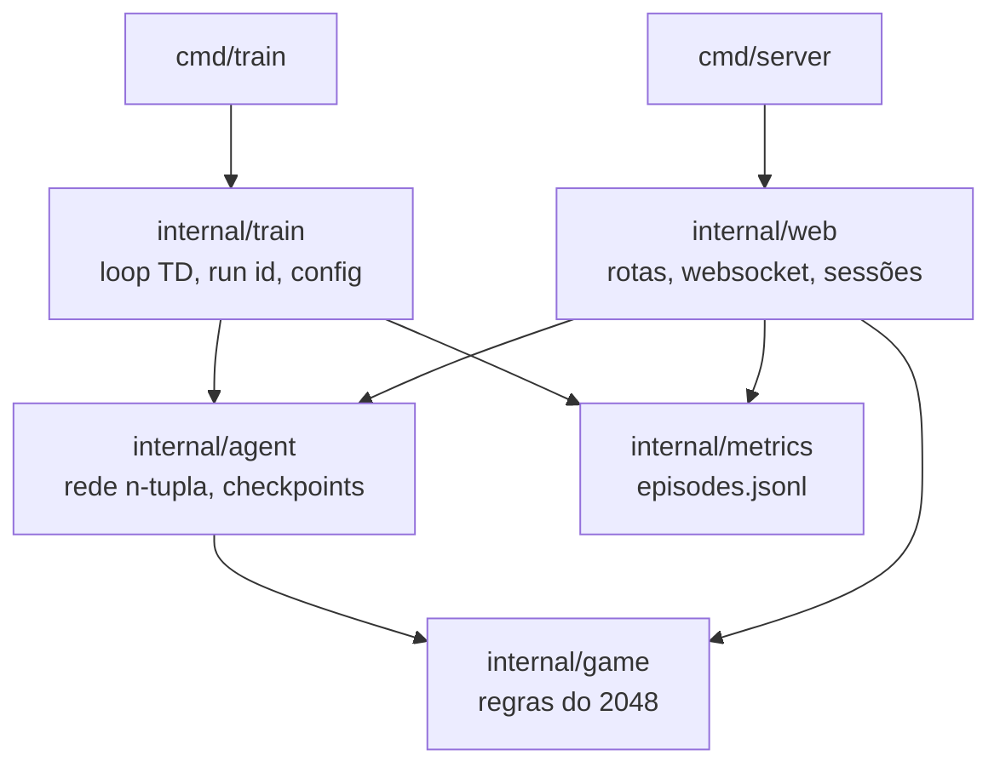

# 2048 RL Agent

Um agente que aprende a jogar 2048 sozinho, por self-play, usando uma rede n-tupla treinada
com TD-learning. O motor do jogo, a rede e o algoritmo de aprendizado são escritos do zero em
Go, sem framework de ML, sem API externa e sem IA generativa em nenhuma parte do pipeline.

O projeto entrega três coisas que dá para abrir no navegador: assistir ao agente jogando ao
vivo, acompanhar a evolução do treino em gráficos e jogar 2048 você mesmo para comparar.

## Rodando localmente

Requisitos: Go 1.23 ou superior. A única dependência externa é `gorilla/websocket`.

**1. Treine um agente.** Os pesos e as métricas vão para `./data`:

```bash
go run ./cmd/train --episodes=1000
```

**2. Suba o servidor** e abra <http://localhost:8080>:

```bash
go run ./cmd/server
```

O modo de jogo humano funciona sem treino nenhum. A visualização ao vivo e o dashboard
precisam de pelo menos um checkpoint em disco.

### Páginas

| Rota | O que faz |
|---|---|
| `/` | Página inicial com o status dos treinos em disco |
| `/live.html` | Assiste ao agente jogando, com seletor de treino e checkpoint |
| `/dashboard.html` | Win rate, score médio e maior tile médio por janelas de episódios |
| `/human.html` | Jogue com as setas do teclado e compare seu placar com o do agente |

### Flags

`cmd/train`:

| Flag | Padrão | Descrição |
|---|---|---|
| `--episodes` | (obrigatória) | Quantos episódios de self-play rodar |
| `--learning-rate` | `0.0025` | Taxa de aprendizado do update TD |
| `--checkpoint-interval` | `1000` | Intervalo de episódios entre checkpoints |
| `--log-interval` | `100` | Intervalo de episódios entre relatórios no console |
| `--run-id` | gerado do horário | Identificador do treino (`run-AAAAMMDD-HHMMSS`) |
| `--data-dir` | `./data` | Onde gravar pesos e métricas |
| `--seed` | horário atual | Semente do gerador aleatório, para reprodutibilidade |

`cmd/server`:

| Flag | Padrão | Descrição |
|---|---|---|
| `--port` | `8080` | Porta HTTP |
| `--data-dir` | `./data` | Diretório com os treinos |
| `--static-dir` | `web/static` | Diretório dos assets do frontend |

Treinos com `--run-id` diferentes gravam em diretórios separados e podem rodar em paralelo.
`Ctrl+C` encerra o treino de forma limpa: termina o episódio atual, grava um checkpoint final
e imprime o resumo.

## Como o agente aprende

### Representação do estado

Avaliar um tabuleiro de 2048 direto é inviável: o espaço de estados é grande demais para uma
tabela e pequeno demais para justificar uma rede neural profunda. A saída clássica é a **rede
n-tupla**: em vez de olhar o tabuleiro inteiro, olha-se um conjunto fixo de janelas (as
tuplas), cada uma com sua própria tabela de pesos.

Este projeto usa **4 tuplas de 6 células cada**:

| Tupla | Células (linha, coluna) |
|---|---|
| T1 | (0,0) (0,1) (0,2) (1,0) (1,1) (1,2) |
| T2 | (0,1) (0,2) (0,3) (1,1) (1,2) (1,3) |
| T3 | (0,0) (1,0) (2,0) (0,1) (1,1) (2,1) |
| T4 | (0,0) (0,1) (0,2) (0,3) (1,0) (1,1) |

Cada célula é codificada pelo expoente de base 2 do seu valor (vazio = 0, tile 2 = 1, tile 4 = 2,
até o teto de 32768 = 15). As 6 células viram um índice posicional de base 16, o que dá
`16^6 = 16.777.216` entradas por tabela. Com `float32`, são cerca de 64 MB por tabela e
256 MB para a rede inteira.

### Simetrias

Um tabuleiro e sua rotação são estrategicamente equivalentes, então não faz sentido aprender os
dois separadamente. Cada tupla é consultada nas **8 simetrias** do tabuleiro (4 rotações x 2
reflexões), sempre na mesma tabela de pesos. Isso multiplica por 8 a experiência aproveitada de
cada jogada e é o que torna as 4 tuplas suficientes para cobrir o tabuleiro todo.

O valor de um tabuleiro é a soma das 4 x 8 = 32 consultas:

```
V(s) = Σ  W[tupla][índice(simetria(s), tupla)]
```

### Escolha da jogada

O agente é guloso puro, sem exploração por epsilon: a aleatoriedade do spawn de tiles já
garante diversidade de estados. Para cada jogada válida ele calcula o **afterstate** (o
tabuleiro depois do deslize e das fusões, antes de nascer o tile novo) e escolhe o maior valor
de `recompensa + V(afterstate)`, onde a recompensa é a soma dos tiles fundidos naquela jogada.

Olhar o afterstate em vez do estado seguinte é o ponto central: o afterstate é determinístico,
enquanto o estado seguinte depende de onde o tile nasceu.

### Update TD-afterstate

O aprendizado usa TD com defasagem de um passo. A cada decisão, o valor do **afterstate
anterior** é ajustado na direção do que se observou depois dele:

```
V(s'_anterior) += α · [ (r + V(s'_atual)) - V(s'_anterior) ]
```

No game over, o último afterstate é ajustado em direção a 0, que é o valor correto de um estado
terminal.

A delta é dividida entre as 32 entradas ativas de forma que `V` do tabuleiro varie exatamente o
valor pedido, inclusive quando duas simetrias caem no mesmo índice. Isso deixa o update linear e
previsível: quem chama controla o passo, e a rede não sabe nada sobre taxa de aprendizado nem
sobre episódios.

## Arquitetura

O motor do jogo não conhece nem a rede nem a web, e a rede não conhece o loop de treino. Os três
consumidores (treino, visualização ao vivo e jogo humano) passam pela mesma API do motor, o que
garante que ninguém joga com regras diferentes.



| Pacote | Responsabilidade |
|---|---|
| `internal/game` | Tabuleiro 4x4, jogadas, fusões, spawn, game over e vitória |
| `internal/agent` | Tuplas, simetrias, avaliação, seleção de jogada, update e checkpoints |
| `internal/train` | Loop de self-play, identidade do run, persistência e relatório de progresso |
| `internal/metrics` | Schema do registro por episódio, escrita append-only e leitura |
| `internal/web` | Servidor HTTP, API REST, WebSocket da live view e sessões do jogo humano |
| `web/static` | Páginas, renderizador de tabuleiro compartilhado e Chart.js vendorizado |

### Artefatos em disco

```
data/
  weights/{run-id}/weights_ep{N}.bin    checkpoint da rede (gob, escrita atômica)
  metrics/{run-id}/episodes.jsonl       um JSON por linha, um por episódio
```

Cada linha de métrica tem `episode`, `score`, `max_tile`, `won` e `moves`, e é sincronizada em
disco na hora, para o dashboard conseguir acompanhar um treino em andamento. Checkpoints são
gravados em arquivo temporário e renomeados no fim, então uma interrupção no meio da escrita
nunca corrompe o checkpoint válido anterior.

### API HTTP

| Método | Rota | Resposta |
|---|---|---|
| GET | `/api/runs` | Treinos em disco, com seus checkpoints e disponibilidade de métricas |
| GET | `/api/runs/{run_id}/metrics?window=100` | Métricas agregadas em janelas de episódios |
| GET | `/ws/live?run_id=&checkpoint=` | Stream WebSocket do agente jogando (300 ms por jogada) |
| POST | `/api/human/new` | Cria uma sessão de jogo humano |
| POST | `/api/human/move` | Aplica uma jogada pelo motor e devolve o novo estado |
| GET | `/api/human/reference` | Score médio e maior tile médio do treino mais recente |

A lista de treinos é lida do disco a cada requisição, sem cache: um treino que terminar com o
servidor no ar aparece sem precisar reiniciar nada.

## Resultados

As métricas são por treino e ficam visíveis no dashboard, em janelas de 100 episódios. O que
esperar: nos primeiros milhares de episódios o score médio sobe rápido e o maior tile sai de 128
para 512; a partir daí o ganho vem mais devagar, e o win rate (fração de episódios que alcançam
o tile 2048) só começa a subir depois que o agente estabiliza a estratégia de canto.

Para reproduzir um treino exatamente, fixe a semente:

```bash
go run ./cmd/train --episodes=50000 --seed=42 --run-id=baseline
```

## Testes

```bash
go test ./...
```

A suíte cobre as regras do jogo, a codificação das tuplas e as simetrias, a linearidade do
update, o round-trip dos checkpoints, o loop de treino, os endpoints REST e o stream WebSocket,
incluindo testes que ligam as features de ponta a ponta (um checkpoint gravado pelo treino é
carregado pela live view, e as métricas gravadas pelo treino são agregadas pelo dashboard).

Para checar concorrência (sessões do jogo humano e conexões simultâneas na live view):

```bash
go test ./... -race
```

## Limitações conhecidas

- Não dá para retomar um treino interrompido: um novo treino começa do zero.
- Cada visitante da live view carrega sua própria cópia da rede (cerca de 256 MB), o que é
  aceitável para uma demo local mas não para uso multiusuário.
- O dashboard só faz polling enquanto o arquivo de métricas foi modificado nos últimos 30
  segundos. Se o treino parar e voltar, é preciso recarregar a página.
- Sessões do jogo humano ficam em memória e expiram após 30 minutos de inatividade, então
  reiniciar o servidor descarta as partidas em andamento.
- Não há autenticação, nem comparação de vários treinos lado a lado no dashboard.

## Créditos

Chart.js v4.4.7 (licença MIT) é distribuído junto, em `web/static/js/vendor/chart.js`, para o
dashboard funcionar sem depender de CDN.
